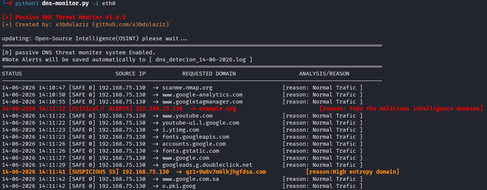

# DNS Monitor

> Passive DNS Threat Monitoring Tool powered by Threat Intelligence feeds and Entropy-based analysis.



## Overview

DNS Monitor is a passive DNS monitoring tool developed in Python using Scapy. It analyzes DNS requests in real time and assigns a risk score to queried domains using multiple detection methods.

The project combines threat intelligence feeds, entropy analysis, and basic domain reputation techniques to identify potentially malicious DNS activity without actively interacting with network traffic.

## Features

* Real-time DNS traffic monitoring
* Passive packet inspection using Scapy
* Threat Intelligence (OSINT) integration
* Entropy-based detection for suspicious domains
* Risk scoring system
* Trusted domains whitelist
* Custom blacklist support
* Alert logging to daily log files
* Lightweight and easy to deploy

## Detection Methods

### Threat Intelligence

The tool automatically downloads and updates indicators from public threat intelligence sources:

* URLHaus
* ThreatFox
* OpenPhish
* Malware Bazaar

Domains found in these feeds receive the highest risk score.

### Entropy Analysis

The Shannon Entropy algorithm is used to detect domains that appear randomly generated, which is a common characteristic of malware-generated domains (DGA).

### Suspicious TLD Detection

Additional risk points are assigned to domains using TLDs frequently observed in malicious campaigns:

* .xyz
* .top
* .shop
* .click
* .online

## Risk Scoring

| Risk Score | Classification |
| ---------- | -------------- |
| 0 - 19     | Safe           |
| 20 - 59    | Suspicious     |
| 60 - 100   | Critical       |

## Project Structure

```text
DNS-Monitor/
├── dns-monitor.py
├── trust.txt
├── blacklist.txt
└── dns_detection_YYYY-MM-DD.log
```

## Installation

Clone the repository:

```bash
git clone https://github.com/x3bdulaziz/DNS-Monitor.git
cd DNS-Monitor
```

Install dependencies:

```bash
pip install -r requirements.txt
```

Or manually:

```bash
pip install scapy requests colorama
```

## Usage

Linux:

```bash
sudo python3 dns-monitor.py -i eth0
```

Wireless Interface:

```bash
sudo python3 dns-monitor.py -i wlan0
```

## Example Output

```text
15-06-2026 10:14:22 [SAFE 0] 192.168.1.10 -> google.com

15-06-2026 10:14:25 [SUSPICIOUS 40] 192.168.1.10 ->
aj38d9f83k2.com [reason: High entropy domain]

15-06-2026 10:14:30 [CRITICAL ALERT] 192.168.1.10 ->
malicious-domain.com [reason: Found in threat intelligence feeds]
```

## Configuration

### trust.txt

Domains listed here are ignored during analysis.

Example:

```text
mozilla.org
```

### blacklist.txt

Custom malicious domains can be added manually.

Example:

```text
bad-domain.com
evil-domain.net
```

## Limitations

* Monitors traditional DNS traffic over UDP port 53.
* DNS over HTTPS (DoH) and DNS over TLS (DoT) are not inspected.
* Administrative privileges may be required for packet capture.
* Windows users may need Npcap installed.

## Disclaimer

This project was created for educational purposes, security research, and defensive monitoring. Use only on networks that you own or have permission to monitor.

## Author

**x3bdulaziz**

GitHub: https://github.com/x3bdulaziz
